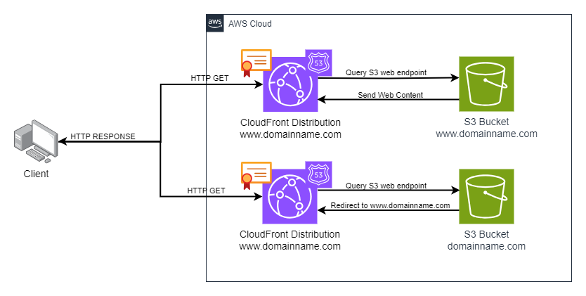

# super-octo-adventures
Hey everyone! Welcome to my super octo adventure. This repository holds three different deployment strategies for a website on AWS. Let dive into it.

## Prerequisites
The following items are prerequisites for this deployment.
<ul>
    <li>Register a domain with AWS</li>
    <ul>
        <li>Create a primary hosted zone for the domain</li>
        <li>Add the necessary records to the hosted zone to register the domain with AWS</li>
    </ul>
    <li>Create IAM credentials with correct permissions for Terraform to assume when building resources</li>
</ul>

## Deployment Overview

### DNS and Certificate Deployment
In all the deployment strategies described below DNS and certificates are generated to support the deployments. Certificate generation depends on the ACME provider and generates a certificate against a domain name that you list. You must own this particular domain and supply the trust DNS servers for validation.

### Website Deployment Strategies
There are three deployment strategies inside this repository. All three of these deployments deploy an AWS hosted website. This website code is hosted in the frontend folder, everything in that folder will be deployed to the corresponding ifnrastructure of the deployment strategy. The three deployment strategies are as follows:
<ol>
    <li>S3 Bucket Deployment</li>
    <li>Containerized Deployment</li>
    <li>Virtual Machine Deployment</li>
</ol>
These deployment strategies will be broken down below. Details will be shared around their architecture diagram, corresponding Terraform modules and the steps to deploy.

## S3 Bucket Deployment
<table>
    <tr>
        <th>Status</th><th>Deployment Cost</th>
    </tr>
    <tr>
        <td>Complete</td><td>Free-Tier eligible / $1> S3 storage costs / CloudFront Dist costs</td>
    </tr>
</table>
The architecture diagram for this diagram is displayed below:

Terraform Module:
module.S3_website_deployment

### Free-tier Eligible
Cloud-Front is free-tier eligible if you stay under 10,000,000 requests per month. Leaving only very minor S3 bucket costs to support this deployment.

## Container Deployment
<table>
    <tr>
        <th>Status</th><th>Deployment Cost</th>
    </tr>
    <tr>
        <td>Not Started</td><td>$X> EC2 infra costs / $1> S3 storage costs</td>
    </tr>
</table>
The architecture diagram for this diagram is displayed below:

Terraform Module:
module.container_website_deployment

## Virtual Machine Deployment
<table>
    <tr>
        <th>Status</th><th>Deployment Cost</th>
    </tr>
    <tr>
        <td>Complete</td><td>Free-Tier eligible / $30> EC2 infra costs / $1> S3 storage costs</td>
    </tr>
</table>
The architecture diagram for this diagram is displayed below:

Terraform Module:
module.vm_website_deployment

### Free-tier Eligible
To make this deployment free-tier eligible, disable logging on the Application Load Balancer and empty the S3 bucket after the deployment is complete. The EC2 instance and application load balancer will be covered under free-tier.
> **_NOTE:_**  free-tier for EC2 application load balancers and EC2 instances is only available for the first 12 months of the account opening

## Scripts
The following scripts are made for ease of management: reset.sh, vmdeploy.sh, s3deploy.sh, containerdeploy.sh
These scripts will be explained below.

### reset.sh
Resets the environment by destroying content from deploy_s3, deploy_vm, deploy_container but leaving certificate related content

### vmdeploy.sh
deploys deploy_vm module including the following resources: networking (1x VPC, 4x subnets, 
1x route table, 1x internet gateway), 1x application loadbalancer, 1x autoscaling group, and 1x S3 bucket

### s3deploy.sh
deploys deploy_s3 module including the following resources: 2x CloudFront distributions and 2x S3 buckets

### containerdeploy.sh
deploys deploy_container module including the following resources: TBD

> **_NOTE:_**  switching between these deployments quickly can run into DNS caching issues locally and at the name server or isp level. This may remove your ability to connect to the website until that records TTL dies.

## Contact

Reach out to me below for any questions:

Email: benwagrez@gmail.com
LinkedIn: https://www.linkedin.com/in/benwagrez/